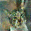
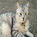

# DCGAN Cat Generator

This repository contains code for training a Deep Convolutional Generative Adversarial Network (DCGAN) to generate images of cats. The DCGAN model is trained on the Cats and Dogs dataset from Kaggle, using TensorFlow 2.0.

# Prerequisites
To run the code in this repository, you will need the following:

- Python 3.6+
- TensorFlow 2.0+
- NumPy
- Matplotlib
- Training the Model

# To train the DCGAN model, and Generate Images, follow these steps:

1. Clone this repository to your local machine.
2. Either use the pictrues of cats from the pre trained model in the repo or find one on kaggle to train your own!
3. Open a terminal and navigate to config.py for hyperparameter tuning[DEFAULT PARAMS CURRENTLY].
4. Run the command <b>python train.py</b> to start training the model.
5. Once the training is complete, the generated images will be saved in the <b>generated_images</b> directory.

# Here are some images of "cats" generated by the DCGAN model:

# Acknowledgments
I do not have the hardware requirements meant to perform a higher resolution output. However, if you have a GTX Gpu you can run this model at much faster speed and get much more accurate. This project was inspired by the TensorFlow DCGAN tutorial, Special thanks to the TensorFlow team for providing the code and resources to create this project.
